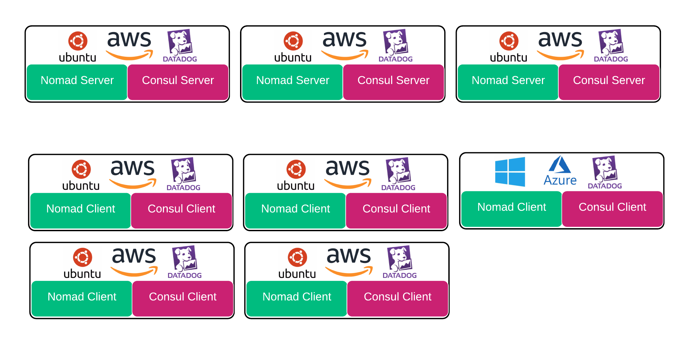
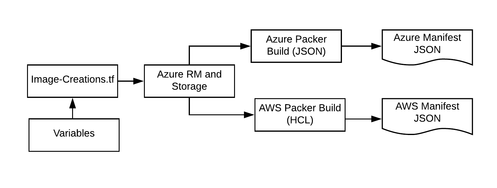
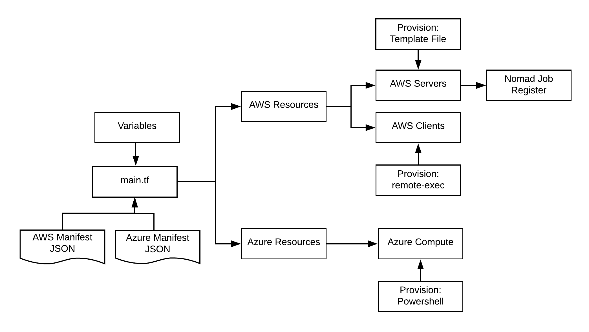

name: Nomad MultiCloud Demo
class: title, shelf, no-footer, fullbleed
background-image: url(https://hashicorp.github.io/field-workshops-assets/assets/bkgs/HashiCorp-Title-bkg.jpeg)
count: false

# HashiCorp Nomad MultiCloud
## Demo Infrastructure

???
This slide deck briefly covers the work for this repository.  The ultimate goal is to demonstrate the flexibility of Nomad as an Orchestrator across multiple environments

---
layout: true

.footer[
- Copyright © 2019 HashiCorp
- 
]

---
exclude: true

name: slides-link
# The Slide Show
## You can follow along on your own computer at this link:
### tbd

???
Here is a link to the slides so you can follow along, but please don't look ahead!

Hidden:  Custom diagrams can be found at Lucidchart
https://app.lucidchart.com/invitations/accept/f8f731cd-104c-4aa5-89f5-abd381671173

---

class: img-right
name:  Impetus for the Project
# What to Do?

.smaller[
* Isolation and Lockdown
    * Keep Ourselves Busy
    * Keep Our Kids Busy!
* Virtual Group Activities
    * Watch Parties
    * Online Games
]

???
Yup, the dumpster fire we call 2020 increased in fervency, and as we all went on lockdown, what would we do with all of that time?  What would our kids do with all of that time?  I know what I would have done...and it wasn't anything good.  So what could we do?  We know everything went online...we could do watch parties, and online games!  Hey, games, that would be a great thing for my Scouts to do together (yes, believe it or not, I'm a Scout leader).  So, I set out on a journey

---
name:  The Seed of Minecraft
# Collaborative Games Online
.smaller[
* Requirements:
    * Online Collaboration
    * Appropriate for Youth
* Minecraft!
* Minecraft with Nomad!
    * Java App - Java Task Driver
    * Container Storage (CSI) - Shared World
    * Simple and Easy

]

???
What games can they do online, work together, AND that would be "Scout" appropriate.  Well...Minecraft!  They can build something together.  And then it hit me...with Nomad Container Storage released, along with auto-scaling, wouldn't it be cool to put a simple Minecraft system together using Nomad?  I can use the Nomad Java Driver, and CSI, and play games as part of my work!  It will be simple!  Well, dreams aren't always reality...

---
class: img-right
name:  Squirrel!
# Start Out Easy...

.smaller[
* Simple Nomad System
* Java and CSI Jobs
* Single Cloud, Single Environment
]

???
My intention was to build a simple Nomad system and hack together a demo, and possibly a blog post.

---
class: img-right
name:  Squirrel!
# Start Out Easy, and Then...

.smaller[
* Simple Nomad System
* Java and CSI Jobs
* Single Cloud, Single Environment
]

???
And then I found Doug.  Yup, I found it to be so easy to squirrel out and start going down the "what if I did this" route.  Note, this is a great example of why every POC/POV/demo needs to be well defined and bounded!

---
name:  End Result
# Current System Architecture

.center[]

???
This is what I ended up with, at least for now.  I have a Server Cluster with Nomad and Consul servers running.  I have 4 Linux nodes in AWS, 1 Windows node in Azure, all connected to that cluster.  And of course, I had to add DataDog into the mix for logging and metrics.

---
name:  Creation Flow
# Two Creation Processes (Step 1)

.smaller[
* Terraform File Kicks Off Flow
    * Builds Necessary Azure Resources for Image
    * Azure Packer Image (using JSON)
    * AWS Packer Image (using HCL)
* Manifest files produced as artifacts
    * Image Information feeds System Creation
]
.center[]

???
Within the 'Image Creation' directory, we have a Terraform file which builds some resources in Azure that are necessary to house the image, and then Terraform uses local-exec to build both Azure and AWS Images.  For variety, I used JSON for the Azure build, and HCL for the AWS build.  This not only provides examples but also shows how much simpler HCL is.  Images include Consul, Nomad, DataDog, and some other goodies.  Manifest files are produced as output to feed the system creation.

---
name:  Creation Flow Part 2
# Two Creation Processes (Step 2)

.smaller[
* A Single Terraform File to Build Them All!
    * Manifest Files and Variables Feed
    * AWS and Azure resources built in Parallel
    * Applications Provisioned as part of the process
]
.center[]

???
-  Now with the images built, we can build the system.  Terraform creates all of the resources for both AWS and Azure, and provisions using remote-exec, powershell, and a template file.  The idea was to try multiple methods for comparisons and examples moving forward.